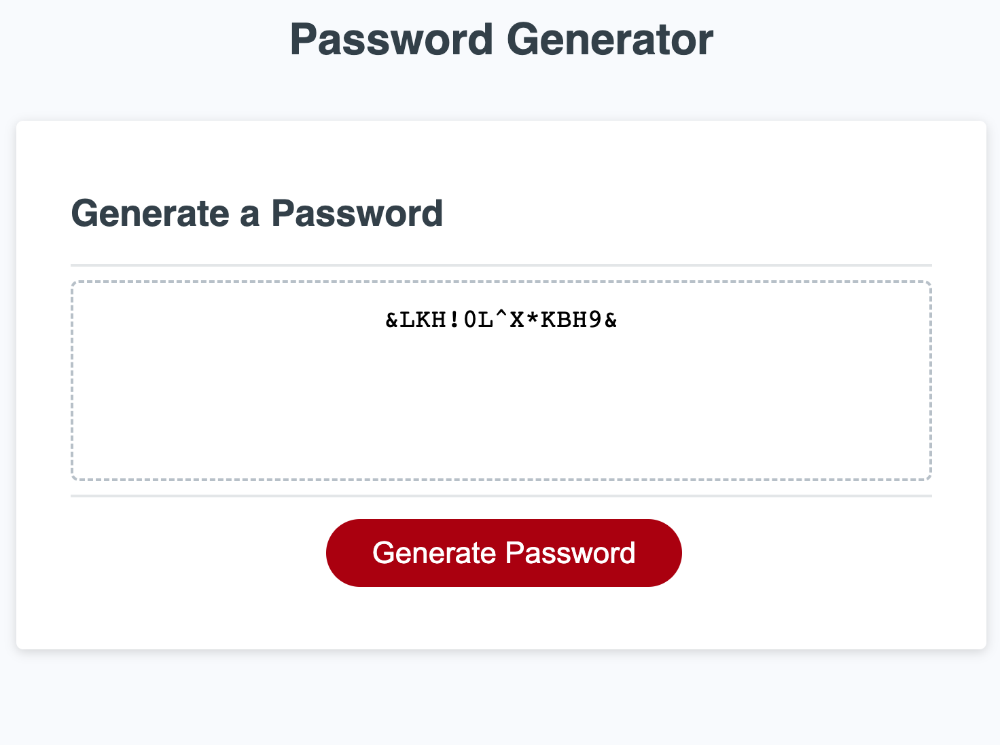

# Password Generator Starter Code

Review starter code

Make sure html is clean and classified in right css style tags

Make sure style sheet and script are linked to html

Review what questions will be asked of user creating password

1. Do you want it to be upper case only
2. Do you want numbers to be in password
3. Do you want special characters to be in password
4. How many characters do you want passord to be 

Confirm the questions and steps

Verify that the password generates with all correct requirements

make sure page works on big or small screens

Link - https://sjbdlt.github.io/SB-Challenge-3-ASU/

